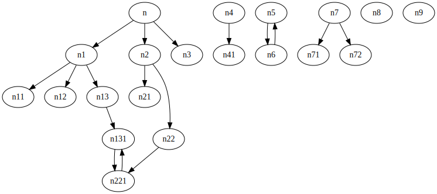
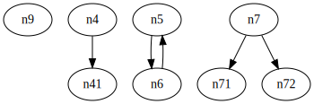

# dotorphan

find orphan graph from dot file

## how to install
```
# for avoiding 'pip Installing collected packages: UNKNOWN'
pip3 install setuptools --upgrade
pip3 install https://github.com/umaumax/dotorphan/archive/master.tar.gz
```

## how to run

```
$ dotorphan sample.dot --exclude n n8 -o out.svg
# all orphan nodes
n9
# all orphan edges
[('n4', 'n41')]
[('n6', 'n5'), ('n5', 'n6')]
[('n7', 'n71'), ('n7', 'n72')]
```

* `input`



* `output` filtered `n` and `n8` nodes



## requires
```
pip3 install networkx
```

```
# darwin
?
# ubuntu
sudo apt-get install -y graphviz libgraphviz-dev
```

```
pip3 install pygraphviz
```

## FYI
* [Overview of NetworkX — NetworkX 2\.4 documentation]( https://networkx.github.io/documentation/stable/index.html )
* [【Python】NetworkX 2\.0の基礎的な使い方まとめ \- Qiita]( https://qiita.com/kzm4269/items/081ff2fdb8a6b0a6112f )
* [python \- How to list specific node/edge in networkx? \- Stack Overflow]( https://stackoverflow.com/questions/12020020/how-to-list-specific-node-edge-in-networkx )
* [misc\-scripts/dot\_find\_cycles\.py at master · jantman/misc\-scripts]( https://github.com/jantman/misc-scripts/blob/master/dot_find_cycles.py )
* [networkXのグラフをgraphvizで出力 \(PyGraphviz\) \- Qiita]( https://qiita.com/genyajoe/items/dff6051a3bccf8f17370 )
