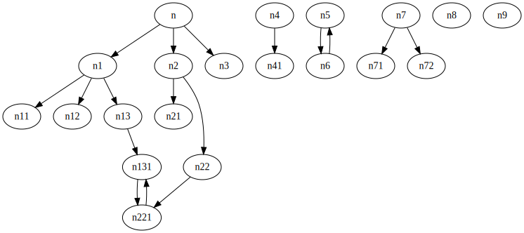
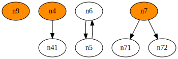

# dotorphan

## how to install
```
# for avoiding 'pip Installing collected packages: UNKNOWN'
pip3 install setuptools --upgrade
pip3 install https://github.com/umaumax/dotorphan/archive/master.tar.gz
```

for zsh completion
```
wget https://raw.githubusercontent.com/umaumax/dotorphan/master/_dotorphan -O /usr/local/share/zsh/site-functions
```

## how to run

```
$ dotorphan sample.dot --remove-traversed n n8 -o out.svg
# all orphan nodes
n9
# all orphan edges
[('n4', 'n41')]
[('n6', 'n5'), ('n5', 'n6')]
[('n7', 'n71'), ('n7', 'n72')]
```

* `input`



* `output` filtered `n` and `n8` nodes



## requires
```
pip3 install networkx
```

```
# darwin
?
# ubuntu
sudo apt-get install -y graphviz libgraphviz-dev
```

for gui
```
pip3 install pygraphviz
```

* `c++filt` for c++ symbol demangling

## examples
```
clang++ -emit-llvm main.cpp -c -o main.bc
clang++ -emit-llvm sub.cpp -c -o sub.bc
llvm-link main.bc sub.bc -o all.bc

opt -analyze -dot-callgraph main.bc && command mv callgraph.dot main.dot
opt -analyze -dot-callgraph  all.bc && command mv callgraph.dot  all.dot

dot -T svg -o main.svg <(cat main.dot | c++filt -n)
dot -T svg -o all.svg  <(cat  all.dot | c++filt -n)

dotorphan --orphan-info-json-output output.json all.dot
cat output.json | jq -r "(.node_list[])"
cat output.json | jq -r "(.nodes_list[])"
cat output.json | jq -r "(.root_node_list[])"
cat output.json | jq -r "(.root_nodes_list[])"

# 'testing::' google test
dotorphan --orphan-info-json-output out.json --remove-traversed '^main$' '^std::(__1)?' '^llvm' '^_' '^testing::' --regex --split-output --output callgraph.filtered.dot callgraph.dot
dot -Tsvg -ocallgraph.filtered.svg callgraph.filtered.dot
dot -Tsvg -ocallgraph.filtered_edge.svg callgraph.filtered_edge.dot
dot -Tsvg -ocallgraph.filtered_node.svg callgraph.filtered_node.dot
```

## bugs
* 自己参照をする関数がroot nodeの場合にorphan nodeとして検出できない(orange色でfillされない)
  * 複数の関数で参照ループを構成している場合も含む

## NOTE
* [umaumax/godot]( https://github.com/umaumax/godot )
  * for converting callgraph node name generated by llvm opt command

## FYI
* [Overview of NetworkX — NetworkX 2\.4 documentation]( https://networkx.github.io/documentation/stable/index.html )
* [【Python】NetworkX 2\.0の基礎的な使い方まとめ \- Qiita]( https://qiita.com/kzm4269/items/081ff2fdb8a6b0a6112f )
* [python \- How to list specific node/edge in networkx? \- Stack Overflow]( https://stackoverflow.com/questions/12020020/how-to-list-specific-node-edge-in-networkx )
* [misc\-scripts/dot\_find\_cycles\.py at master · jantman/misc\-scripts]( https://github.com/jantman/misc-scripts/blob/master/dot_find_cycles.py )
* [networkXのグラフをgraphvizで出力 \(PyGraphviz\) \- Qiita]( https://qiita.com/genyajoe/items/dff6051a3bccf8f17370 )
